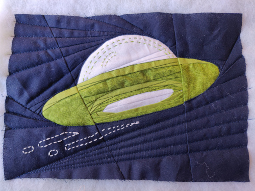

# Open Liberty quilted rug mug pattern

TODO:
- Re-create photo of drawing seam allowances (re-print the numbered version of the template)
- Re-create exploded photo using numbered version of template(?)

This pattern uses Foundation Paper Piecing (FPP) which is a method of patchwork piecing that requires a sewing machine.

Finished size of the rug mug when bound is approximately 11.25" x 8" (28.5cm x 20cm) (slightly smaller than A4).

If you're confident using a sewing machine and you've done some basic patchwork and quilting but you've never done any FPP before, I would suggest doing an FPP tutorial then practising with a simple picture-type of pattern first. I've included some links to tutorials that I used to learn FPP at the end.

## Materials and tools

### Materials

- A fat eighth of lighter green (lime green) fabric
- A fat eighth of darker green fabric (I used Makower UK Emerald Isle Green, which gives a bit more visual texture, imho, but a solid/plain green fabric would probably work just fine)
- A fat eighth of solid white fabric
- A fat quarter of solid navy fabric
- A piece of fabric for backing (I suggest using more of the solid navy fabric as I think the quilting on the back would look neater, but I used the green grass fabric because I didn't have enough navy from a fat quarter)
- A piece of fabric for binding (2 strips of 20" (width of fat quarter) x 2.5" sewn together into a single strip) There should be sufficient left from your navy fat quarter.
- White polyester piecing thread
- Navy blue quilting thread (I just used polyester thread as it's what I had and it matched the navy background fabric)
- Bright (lime) green embroidery floss (to match the green fabrics)
- White embroidery floss

### Tools

- Printer (to print out three copies of the paper template)
- Transparent quilting ruler (in inches) and pencil (to add 1/4" seam allowances to paper template pieces before cutting them out)
- Paper scissors (to cut out the paper template pieces)
- Sewing machine (set to 1.8mm stitch length; using 1.5mm just destroyed the paper template too easily if I made a mistake and had to unpick a seam)
- Sewing machine walking foot (for quilting)
- Fabric scissors or rotary cutter with a fresh blade (for trimming the seam allowances; some of the seams in section A and B in particular end up with several layers of fabric so a sharp blade is essential)
- Embroidery needle
- Quilting pins and binding clips

## Preparing the paper templates

1. Print out three copies of the template.
2. Add add 1/4" seam allowances around each section:
  - Copy 1: Section E and Section D
  - Copy 2: Section A and Section C
  - Copy 3: Section B
  
    In the following image, I'm adding a 1/4" seam allowance on to each of Sections D and E using a quilting ruler and pencil (Sections A, B, and C of this copy will be discarded):
  
3. Cut out the five sections from their respective copies of the template.

The following image shows the five template sections cut out with their 1/4" seam allowances shaded red for clarity:

Note that in some of the photos that i took of my own sewing, the template is not exactly the same as the one here. That's because I revised the order of sections and labelling in the final template. But the pattern is the same.

## Making the quilt

I'm going to assume that you know how to do FPP piecing so I'll just give instructions specific to this pattern, including tips I found useful when I was making it myself.

### 1. Piecing the sections

Piece each section

Join A to B and A to C, then A-C to D, then A-D to E.

Trim the edges of completed sections only when ready to sew that seam. Wait until you've assembled all five sections before you trim the outside edge.

### 3. Embroider the details

### 4. Quilt and trim

Remove the paper template.

### 5. Bind

## Tutorials

I did this tutorial (which creates a simple symmetrical start design): https://weallsew.com/beginner-friendly-foundation-paper-piecing/
I then learnt a lot of more practical tips (eg cutting the fabric to size only after sewing the seam; the repeatable sequence of steps to follow for each piece of fabric you add to the block) from watching this video (which creates an irregular but simple [single-section] picture-type design): https://youtu.be/NhMWjUDbHcQ
How to paper piece a combination block part 1: https://youtu.be/ZjEO_ErvxJ4
part 2: https://youtu.be/SzhaQkaqRrQ
And completed this frog block which is one of Marney's designs: https://www.etsy.com/uk/listing/1022198969/frog-on-lily-pad-paper-pieced-block
Quilting a quilt (https://www.sewmotion.com/the_quilting.html)
Binding a quilt (https://www.sewmotion.com/the_binding.html)