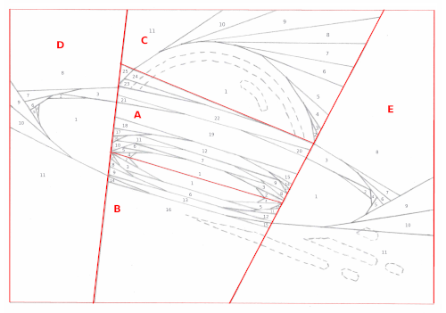
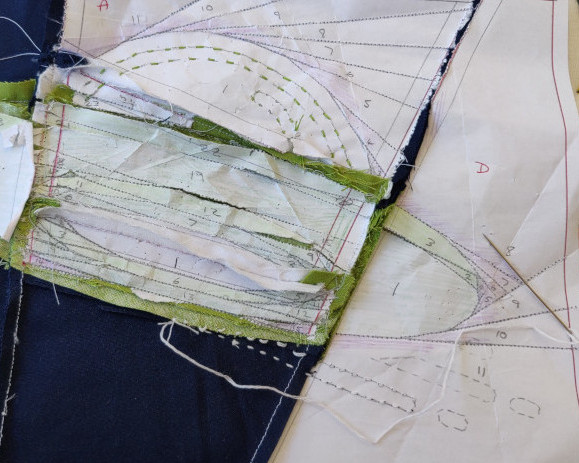

# Open Liberty mug rug mini quilt pattern

This pattern uses Foundation Paper Piecing (FPP) which is a method of patchwork piecing that uses a paper template and requires a sewing machine.

The finished size of the mug rug mini quilt when bound is approximately 11.25" x 8" (28.5cm x 20cm) (slightly smaller than A4):

If you're confident using a sewing machine and you've done some basic patchwork and quilting but you've never done any FPP before, I would suggest doing an FPP tutorial then practising with a simple picture-type of pattern first. I've included some links to [tutorials that I used to learn FPP](#tutorials).

Note that in some of the photos of the template in these instructions and the photos I took of my own sewing, the template pieces shown look slightly different from the template provided with these instructions. That's because I revised the labelling and the order of sections in the final template. But the pattern is the same.

The template and instructions for this pattern are by Laura Cowen but the Open Liberty logo, the design on which it is based, is [owned and licensed by IBM](https://github.com/OpenLiberty/logos/blob/main/LICENSE.adoc).

## Materials

Quilting cotton fabrics:
- A fat eighth of lighter green (lime green)
- A fat eighth of darker green (I used Makower UK Emerald Isle Green)
- A fat eighth of solid white
- A fat quarter of solid navy
- A strip of binding (two strips of 20" (width of fat quarter) x 2.5" sewn together into a single strip). There should be sufficient left from your navy fat quarter.
- A piece of backing. I used the Makower UK Emerald Isle Green but I think the solid navy might look better after quilting.
- White polyester piecing thread (stronger than cotton when you're ripping the template pieces off later)
- Navy blue quilting thread (I used polyester as that's what I had)
- Bright (lime) green embroidery floss
- White embroidery floss

## Tools

- Printer (to print out the [paper template](https://github.com/lauracowen/openliberty-rugmug/blob/main/pdfs/open-liberty-logo-mugrug-fpp-template.pdf); I've only tested on A4 paper but letter should be fine)
- Transparent quilting ruler (in inches) and pencil (to add 1/4" seam allowances to paper template pieces)
- Paper scissors (to cut out the paper template pieces)
- Sewing machine (set to 1.8mm stitch length for piecing; 3.5mm for quilting), ideally with a walking foot for quilting
- Fabric scissors or rotary cutter with a fresh blade (for trimming the seam allowances; some of the seams in section A and B in particular end up with several layers of fabric so a sharp blade is essential)
- Embroidery needle
- Quilting pins and binding clips

## Preparing the paper templates

The [FPP template](https://github.com/lauracowen/openliberty-rugmug/blob/main/pdfs/open-liberty-logo-mugrug-fpp-template.pdf) looks like this:

1. Print out three copies of [the template](https://github.com/lauracowen/openliberty-rugmug/blob/main/pdfs/open-liberty-logo-mugrug-fpp-template.pdf).
2. Add add 1/4" seam allowances around each section:
   - Copy 1: Section E and Section D
   - Copy 2: Section A and Section C
   - Copy 3: Section B
  
     For example, in the following image, I'm adding a 1/4" seam allowance on to each of Sections D and E using a quilting ruler and pencil (Sections A, B, and C of this copy will be discarded):
  
3. Cut out the five sections from their respective copies of the template.

The following image shows the five template sections cut out with their 1/4" seam allowances shaded red for clarity:

Note that the outside edge probably isn't exactly a 1/4" allowance when printed out (especially if you're not using A4 paper) so use a ruler to measure the allowance for yourself when trimming the outside edge of the block before binding.

## Making the quilt

I'm going to assume that you know how to do FPP piecing so I'll just give instructions specific to this pattern, including tips I found useful when I was making it myself.

### 1. Piece the sections

Piece each section, following the numbers in the pattern, according to the FPP method. Remember to set your machine sitch length to shorter than normal so that you can tear the paper template off later.

> **Tip:**
I used 1.8mm stitch length after finding that 1.5mm ripped the template too easily if I need to unpick and re-sew a seam.

Pieced Section C:

>**Tip:**
Don't trim the completed sections yet.

### 2. Join the sections

Join the sections: A to B and A to C, then A-C to D, then A-D to E.

>**Tip:**
Wait until you're ready to sew a section seam before you trim the edges of that seam. Wait until you've assembled all five sections before you trim the outside edge of any section.

The pieced quilt top:

### 3. Embroider the details

Use the embroidery floss split into 3-strand lengths.

Working from the back (so you can see the template), embroider the reflection on the white dome (green floss) and the whooshes under the spaceship on the navy background (white floss):

(Yes, I forgot to embroider one of the white whooshes...)

### 4. Quilt

Remove the paper template. This can be a bit slow with so many seams.

>**Tip:**
I (very carefully!) used a seam ripper in places to tease the tiniest paper pieces out.

Make your quilt sandwich (quilt top, then wadding, then backing) and pin.

Quilt as desired. Remember to set your machine sitch length to longer than normal (eg 3.5mm).

>**Tip:**
You can quilt in any way you like but here's what I did (making it up as I went along):

>* Used navy polyester thread 
>* Sewed round the outline of the spaceship.
>* Sewed along all the piecing lines of the navy pieces (not the section lines), extending the piecing lines to the edge of the quilt where necessary.
>* Drew some sloping lines from the bottom edge of the quilt following the angle of the spaceship, then quilted along the lines to give the picture more whoosh!

>I like the final effect as I think it emphasises the angle and whooshing of the spaceship:

>

### 5. Trim and bind

Trim and bind the quilt using the navy binding strip.

And you're done! Time to get a cup of tea and biscuit to celebrate.

## Tutorials

I don't explain how to do foundation paper piecing (FPP) in these instructions or how to quilt and bind a quilt. So here are some resources I found useful.

### Foundation paper piecing (FPP)

If you've never done foundation paper piecing (FPP) before, you'll need to learn how to piece the sections before you start. Here are the resources I used to help me learn:

* [How to create a simple symmetrical star block](https://weallsew.com/beginner-friendly-foundation-paper-piecing/)
* [How to create a simple (single-section) block](https://youtu.be/NhMWjUDbHcQ)  - Loads of practical tips for making a picture (eg cutting the fabric to size only after sewing the seam; the repeatable sequence of steps to follow for each piece of fabric you add to the block).
* [How to paper piece a combination (multi-section) block Part 1](https://youtu.be/ZjEO_ErvxJ4)
* [How to paper piece a combination (multi-section) block Part 2](https://youtu.be/SzhaQkaqRrQ)

I practised making a picture by completing this [frog block, which you can buy on Etsy](https://www.etsy.com/uk/listing/1022198969/frog-on-lily-pad-paper-pieced-block).

### Quilting and binding

In case they're useful, here are some tutorials I used when finishing the mug rug mini quilt:

* [Quilting a quilt](https://www.sewmotion.com/the_quilting.html)
* [Binding a quilt](https://www.sewmotion.com/the_binding.html)
* [Joining binding ends](https://www.sewmotion.com/joining_binding_ends.html)

## Licence

 Open Liberty mug rug mini quilt pattern by <a xmlns:cc="http://creativecommons.org/ns#" href="https://www.lauracowen.co.uk/" property="cc:attributionName" rel="cc:attributionURL">Laura Cowen</a> is licensed under a <a rel="license" href="http://creativecommons.org/licenses/by-nd/4.0/">Creative Commons Attribution-NoDerivatives 4.0 International License</a>. Based on a work at <a xmlns:dct="http://purl.org/dc/terms/" href="https://github.com/lauracowen/openliberty-rugmug" rel="dct:source">https://github.com/lauracowen/openliberty-rugmug</a>.

The Open Liberty logo, the design on which this mug rug mini quilt is based, is used under the [terms set out by IBM](https://github.com/OpenLiberty/logos/blob/main/LICENSE.adoc).
